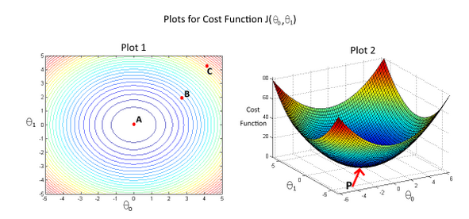

# Machine Learning - Week 1 - Quiz 2 :
##### Github Repo for course: [Stanford Machine Learning (Coursera)](https://github.com/anigaundar/Coursera-Machine-Learning-Andrew-Ng)

Question 1
-----------
Consider the problem of predicting how well a student does in her second year of college/university, given how well she did in her first year.

Specifically, let x be equal to the number of "A" grades (including A-. A and A+ grades) that a student receives in their first year of college (freshmen year). We would like to predict the value of y, which we define as the number of "A" grades they get in their second year (sophomore year).

Here each row is one training example. Recall that in linear regression, our hypothesis is *h&theta;(x) = &theta;0 + &theta;1x* and we use m to denote the number of training examples.

For the training set given above (note that this training set may also be referenced in other questions in this quiz), what is the value of m? In the box below, please enter your answer (which should be a number between 0 and 10).

Answer: 
| 4|
|---|

Question 2:
--------
consider the following training set of m = 4 training examples:
|x|y|
|---|---|
|1|0.5|
|2|1|
|4|2|
|0|0|

consider the linear regression model *h&theta;(x) = &theta;0 + &theta;1x* what is the values of &theta;0 and &theta;1 that you would expect to obtain upon running gradient descent on this model? (linear regression will be able to fit this data perfectly.)

* &theta;0 = 1 , &theta;1 = 1
* &theta;0 = 0.5 , &theta;1 = 0.5
* &theta;0 = 1 , &theta;1 = 0.5
* &theta;0 = 0 , &theta;1 = 0.5
* &theta;0 = 0.5 , &theta;1 = 0

Answer|explanation
|---|---|
|&theta;0 = 0 , &theta;1 = 0.5| it is clear that for x = 0, y = 0 it means the linearregression line passiong through (0,0) i.e. hypothesis function h&theta;(0) = &theta;0 + &theta;1(0) = &theta;0 = 0 , similarly slope of line can be observed to be equal to 1/2 = 0.5 so  &theta;1 = 0.5

Question 3:
--------
Suppose we set &theta;0 = -2 , &theta;1 = 0.5 in the linear regression hypothesis from Q.1 what is h&theta;(6) ?

Answer: 

|1|
|---|

Question 4:
--------------
In the given figure, the cost function J(&theta;0,&theta;1) has been plotted against &theta;0 and &theta;1, as shown in 'plot 2'. The contour plot for the same cost function is given in 'Plot 1'. Based on the figure, choose the correct options (check all that apply).

* If we start from point B, gradient descent with a well-chosen learning rate will eventually help us reach at or near point A, as the value of the cost function J(&theta;0,&theta;1) is minimum at A.
* If we start from point B, gradient descent with a well-chosen learning rate will eventually help us reach at or near point C, as the value of the cost function J(&theta;0,&theta;1) is minimum at C.
* Point P(the golabal minimum of plot 2) corresponds to point A of plot 1.
* Point P(the golabal minimum of plot 2) corresponds to point C of plot 1.
* If we start from point B, gradient descent with a well-chosen learning rate will eventually help us reach at or near point A, as the value of the cost function J(&theta;0,&theta;1) is maximum at point A.

True/False | Statement|Explanation
---|---|---
True|If we start from point B, gradient descent with a well-chosen learning rate will eventually help us reach at or near point A, as the value of the cost function J(&theta;0,&theta;1) is minimum at A. | in
